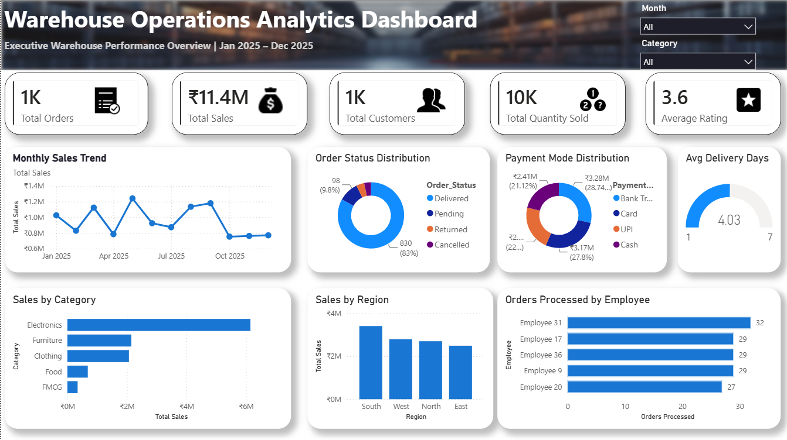

# 📦 Warehouse Operations Analytics Dashboard

## 📖 Overview

This project is an interactive Power BI dashboard designed to analyze warehouse operations and provide business insights through data visualization.

The dashboard helps monitor warehouse performance by tracking sales trends, order status, regional performance, delivery efficiency, customer activity, and employee productivity.

---

## 📊 Dashboard Preview

---

## 🎯 Objectives

- Monitor warehouse performance
- Track monthly sales
- Analyze order status
- Evaluate regional sales
- Measure delivery performance
- Compare product categories
- Monitor employee productivity

---

## 📌 Key KPIs

- Total Orders
- Total Sales
- Total Customers
- Total Quantity Sold
- Average Rating
- Average Delivery Days

---

## 📈 Dashboard Insights

### Monthly Sales Trend
Visualizes sales performance throughout the year.

### Order Status Distribution
Tracks Delivered, Pending, Returned and Cancelled orders.

### Payment Mode Distribution
Shows customer payment preferences.

### Sales by Category
Identifies top-performing product categories.

### Sales by Region
Compares warehouse sales across different regions.

### Orders Processed by Employee
Highlights employee productivity.

---

## 🛠 Tools Used

- Power BI
- Microsoft Excel
- DAX
- Data Modeling
- Data Visualization

---

## 📂 Files Included

- Dashboard.pbix
- WMS Dataset.xlsx
- Dashboard Screenshot

---

## 🚀 Skills Demonstrated

- Data Cleaning
- Data Visualization
- KPI Design
- Dashboard Design
- Business Analytics
- DAX Measures
- Interactive Reporting

---

## 👨‍💻 Author

**Swarnim Kale**

Aspiring Data Analyst

GitHub:
https://github.com/swarnimkale1610
